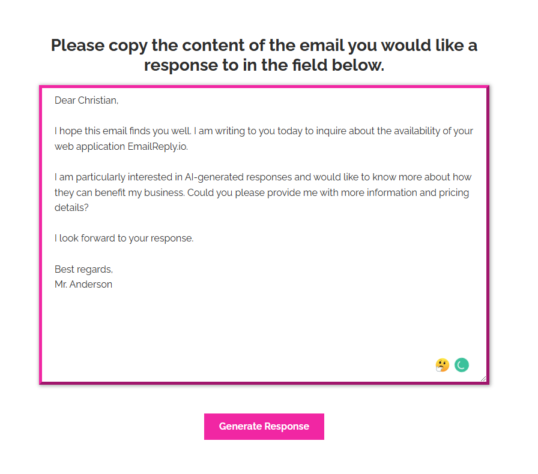
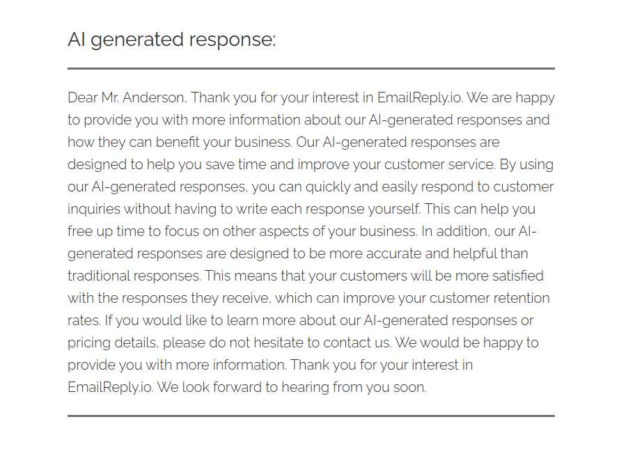

# EmailReply.io

EmailReply.io is an open source web application build with .NET 7 and Blazor.

    

 

## Description

EmailReply.io is a free web application that helps users generate written responses to any form of written communication. Whether you need to reply to an email, message, or other written communication, EmailReply.io can assist you with crafting a professional and appropriate response.

With EmailReply.io, you can quickly and easily generate responses to a wide range of communication types, including customer service inquiries, support requests, and general communication. The application uses advanced artificial intelligence algorithms to understand the context of your communication and generate appropriate responses.

In addition to its AI-powered response generation capabilities, EmailReply.io also offers a range of helpful features, such as customizable templates, the ability to save and reuse responses, and integration with popular email clients.

Whether you're a busy professional, small business owner, or just looking for a convenient way to communicate more effectively, EmailReply.io has you covered. Try it out today and see how it can help you save time and communicate more effectively.

 

 

